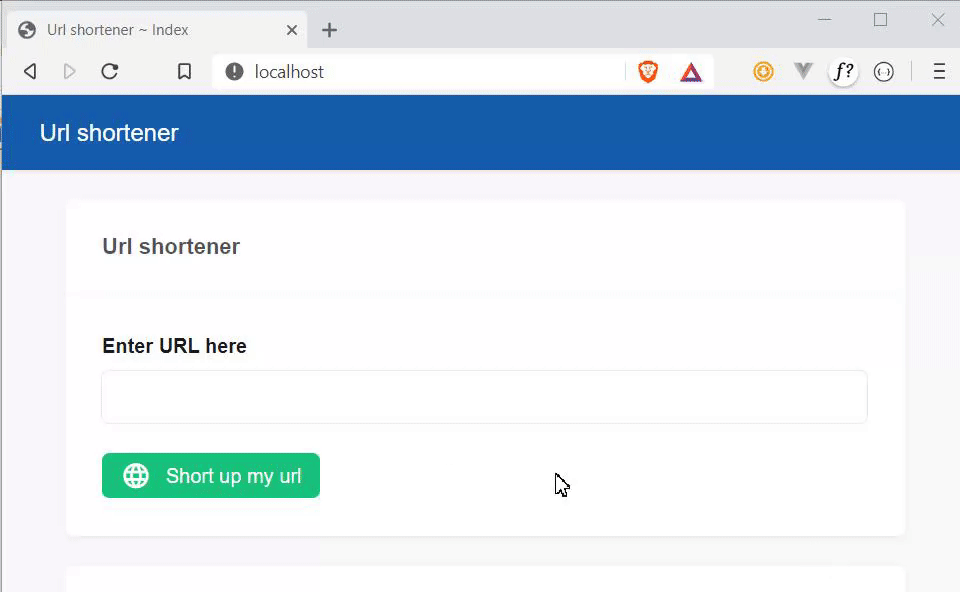

# Url shortener
A PHP script to short up URL.

*If you need to see the project structure then please [click here.](STRUCTURE.md)*

This script uses LatteUI, and a little code of Vue.js. 
This script will not be continued to development. 

# How to use

**1.** Download this project. 
**2.** Upload this project to your environment 
**3.** Run `npm install` to install the needed dependencies. 
**4.** Go to the index.php file. 
**5.** Enter up a URL and hit the green button. 

# Preview

# Dependencies

**1.** https://github.com/basmilius/latte-ui  
**2.** Vue.js 

# Sponsor me

*By sponsoring me, you will show that you love my work. Also, I wil get more motivated to work on open projects and maintain them.*

GitHub: https://github.com/sponsors/Julianvschijndel  
PayPal: https://www.paypal.me/juliandevnl  
Buy me a coffee: https://www.buymeacoffee.com/JulianDev  
Bitcoin: 1HACXLLGQZQj2zB5NheztA1bdsdQZwHxmh 
Ethereum: 0x5EAc4d7a1B6AF4E4F7BA2f780beCe8811D5aC225 
BAT: 0x5EAc4d7a1B6AF4E4F7BA2f780beCe8811D5aC225 
